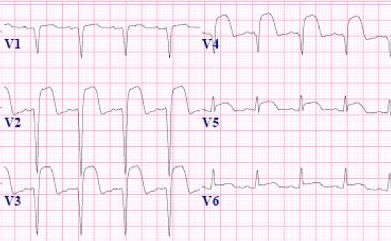
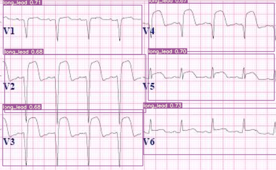
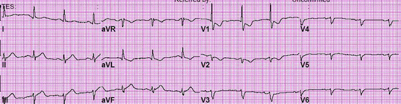
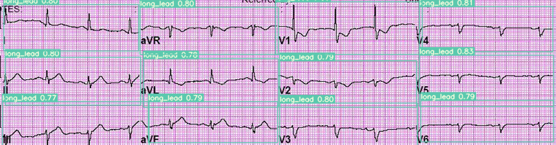

# Finetuning YOLOv7 for ECG lead detection

## Introduction
Multilead ECG images provide a multi-perspective view of the heart's electrical activity by displaying ECG segments from different leads simultaneously. Each lead captures electrical signals from distinct angles and planes of the heart, offering a unique view of its function. By comparing the segments from multiple leads, clinicians can more accurately diagnose various cardiac conditions, such as ischemia, arrhythmias, and myocardial infarctions. This multidimensional approach enhances the ability to detect subtle abnormalities that might be missed when using a single lead, ultimately improving patient outcomes through more precise and detailed cardiac assessments.

Detecting the boundary boxes around the different leads in ECG images is required for extracting the ECG time series of each lead. This is a nontrivial task in real ECG images. Adjacent leads can run into each other due to measurement noises, baseline wander and ECG amplitudes. They are also impacted by the angle of view and perspective of scanned ECG images or pictures. The problem can be studied from an image segmentation or region of interest (ROI) detection perspective. We provide a solution for this problem using the YOLO model.

YOLO stands for "You Only Look Once"; it is a popular family of real-time object detection algorithms. The original YOLO object detector was first released in 2016. Our ROI detection codebase is built upon [YOLOv7](https://github.com/WongKinYiu/yolov7). The official YOLOv7 paper, titled "YOLOv7: Trainable bag-of-freebies sets new state-of-the-art for real-time object detectors," was released in July 2022 by [Chien-Yao Wang, Alexey Bochkovskiy, and Hong-Yuan Mark Liao](https://doi.org/10.48550/arXiv.2207.02696).

## Installation
- Setup with Conda env: 
     ```
     conda env create -f environment.yml
     conda activate ROI
     ```

- Set up with pip:
        
    ```
    pip install -r requirements.txt
    ```


## Training the model
In this repo, we use YOLOv7 to detect different leads in the ECG image. The codebase has been modified specifically for ECG images. 

### Custom Data
- To tune the YOLOv7 model (or its more recent updates) with this codebase, make sure your custom data is arranged as follows:

        - data
            - train
                - images
                    - 1.png
                    - 2.png
                    - 3.png
                - labels
                    - 1.txt
                    - 2.txt
                    - 3.txt
    
    The labels should be in a text file, with every line corresponding to a different bounding box. The first value should be the label of the object in the box. The next four values should correspond to the bounding box attributes, in the format xywh [center of the bouding box in x coordinate, center of the bouding box in y coordinate, width of the box, height of the box]. All the box attributes should be normalized with respect to the box dimensions.

    *Note:* The label list should be decided by the user.

    Example images:
    
    | ECG Image                           | Ground truth ECG image                            |
     | ----------------------------------- | ----------------------------------- |
     |  |  |

     | ECG Image                           | Ground truth ECG image                            |
     | ----------------------------------- | ----------------------------------- |
     |  |  |

     | ECG Image                           | Ground truth ECG image                            |
     | ----------------------------------- | ----------------------------------- |
     |  |  |

    Some example images and ground truth Txt file can be found here : [Data/train_imgs](Data/train_imgs/) and  [Data/GT_txt](Data/GT_txt/)

    Add the train and validation path, number of object classes and the names of classes to the data config file at: [yolov7/data/custom_data.yaml]([yolov7/data/custom_data.yaml). Make sure the order of classes is in line with the list of [0, number of objects - 1].

### Training Configs

- Calibrate the hyperparameters of your choice by changing the values in the file : [data/hyp.scratch.custom.yaml](data/hyp.scratch.custom.yaml)

- The model architecture, output shape and other training attributes can be changed through the config file: [cfg/training/yolov7_custom.yaml](cfg/training/yolov7_custom.yaml) 


### Training the model
The following attributes can be changed for the training pipeline: 
- `--weights`: Initial weights path; default: yolov7.pt, type: str
- `--cfg`: Configs file, type=str, default=''
- `--data`: Data configs file, type=str, default='data/coco.yaml'
- `--hyp`: Hyperparmeter configs file, type: str, default: 'data/hyp.scratch.p5.yaml'
- `--epochs`: Number of epochs to train the model, type: int, default: 300
- `--batch-size`: Batch size of the data while training, type : int, default: 16
-  `--img-size`: Train/test image size, type: int, default: 640
- `--rect`: Rectangular training, action: 'store true' 
- `--resume`: Resume the most recent training, default: False
- `--nosave`: Only save the final checkpoint, active: store true, default: False
- `--notest`: Only test the final epoch, action: store true, Default: False
- `--noautoanchor`: Disable autoanchor check, action: store true
- `--evolve`: Evolve Hyperparameter, action: store true
- `--bucket`: Gsutil bucket, type: str
- `--cache-images`: Cache images for faster training, action: store true,
- `--image-weights`: Use weighted image selection for training, action: store true
- `--device`: cuda device, i.e. 0 or 0,1,2,3 or cpu
- `--multi-scale`: Vary img-size +/- 50%% ,action: 'store true'
- `--single-cls`: Train multi-class data as single-class, action: 'store true'
- `--adam`: use torch.optim.Adam() optimizer, action: 'store true'
- `--sync-bn`: use SyncBatchNorm, only available in DDP mode', action: 'store true'
- `--local_rank`: DDP parameter, do not modify, type: int, default: -1
- `--workers`: Maximum number of dataloader workers, type: int, default: 8 
-`--project`: save to project/name, default: 'runs/train'
- `--entity`: W&B entity
- `--name`: save to project/name, default='exp'
- `--exist-ok`: existing project/name ok, do not increment,  action: 'store true'
- `--quad`: quad dataloader, action: 'store true'
- `--linear-lr`: linear LR, action: 'store true'
- `--label-smoothing`: Label smoothing epsilon, type: float, default: 0.0
- `--upload_dataset`: aUpload dataset as W&B artifact table, action: store true
- `--bbox_interval`: Set bounding-box image logging interval for W&B, type: int, default: -1 
-`--save_period`:  Log model after every "save_period" epoch, type: int, default: -1
- `--artifact_alias`: version of dataset artifact to be used, type: str, default: latest
- `--freeze`: Freeze layers: backbone of yolov7=50, first3=0 1 2, type:int, default: [0]
-`--v5-metric`: assume maximum recall as 1.0 in AP calculation, action: store true
        
``` shell
python train.py --batch-size 4 --epochs 100 --img 640 --data data/custom_data.yaml --hyp data/hyp.scratch.custom.yaml --cfg cfg/training/yolov7_custom.yaml --name lead_roi_yolov7 --weights yolov7.pt 
``` 

Refer the training script for further information: [yolov7/train.py](yolov7/train.py)    


### ECG lead detection

To test the model and get the detection results, run the following command: 

``` shell
python detect.py --weights yolov7_custom.pt --conf 0.5 --img-size 640 --source <path-to-folder>
```
The default outputs can be found here: [runs/detect/exp](runs/detect/exps). The following attributes can be changed for the detection script:

- `--weights`: Model weight path, default: 'yolov7.pt', type: str
- `--source`: Source to the test set images, default: 'inference/images', type: str
- `--img-size`: Inference size in pixels, default: 640, type: int 
- `--conf-thres`: Object confidence threshold, default: 0.25, type: float
- `--iou-thres`: IOU threshold for NMS, default: 0.45, type: float
- `--device`: Cuda device, i.e. 0 or 0,1,2,3 or cpu
- `--view-img`: Display results, action: store true
- `--save-txt`: Save results to *.txt, action: store true
- `--save-conf`: Save confidences in --save-txt labels, action: store true
- `--nosave`: Donot save images/videos, action: store true
- `--classes`: Filter by class: --class 0, or --class 0 2 3, type: int
- `--agnostic-nms`: Class agnostic NMS, action: store true
- `--augment`: Augmented inference, action: store true
- `--update`: Update all models, action: store true
- `--project`: Save results to project/name, default: 'runs/detect'
- `--name`: Save results to project/name, default: 'exp'
- `--exist-ok`: Existing project/name ok, do not increment, action: store true
- `--no-trace`: Dont trace model, action: store true
     
## Citation
Please include references to the following articles in any publications:

1. Kshama Kodthalu Shivashankara, Deepanshi, Afagh Mehri Shervedani, Matthew A. Reyna, Gari D. Clifford, Reza Sameni (2024). ECG-image-kit: a synthetic image generation toolbox to facilitate deep learning-based electrocardiogram digitization. In Physiological Measurement. IOP Publishing. doi: [10.1088/1361-6579/ad4954](https://doi.org/10.1088/1361-6579/ad4954)


2. ECG-Image-Kit: A Toolkit for Synthesis, Analysis, and Digitization of Electrocardiogram Images, (2024). URL: [https://github.com/alphanumericslab/ecg-image-kit](https://github.com/alphanumericslab/ecg-image-kit)

## Contributors
- Deepanshi, Department of Biomedical Informatics, Emory University, GA, US
- Mohammad Ahmad, School of Electrical and Computer Engineering, Georgia Institute of Technology, Atlanta, GA, US
- Kshama Kodthalu Shivashankara, School of Electrical and Computer Engineering, Georgia Institute of Technology, Atlanta, GA, US
- Matthew A Reyna, Department of Biomedical Informatics, Emory University, GA, US
- Gari D Clifford, Department of Biomedical Informatics and Biomedical Engineering, Emory University and Georgia Tech, GA, US
- Reza Sameni (contact person), Department of Biomedical Informatics and Biomedical Engineering, Emory University and Georgia Tech, GA, US

## Contact
Please direct any inquiries, bug reports or requests for joining the team to: [ecg-image-kit@dbmi.emory.edu](ecg-image-kit@dbmi.emory.edu).


