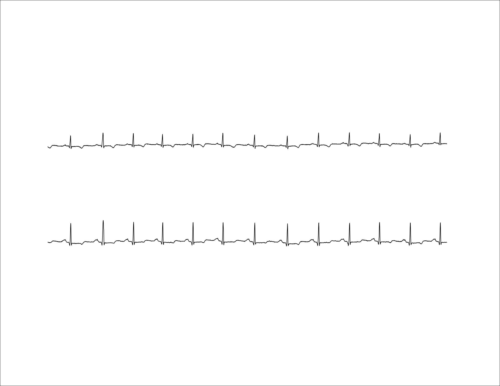
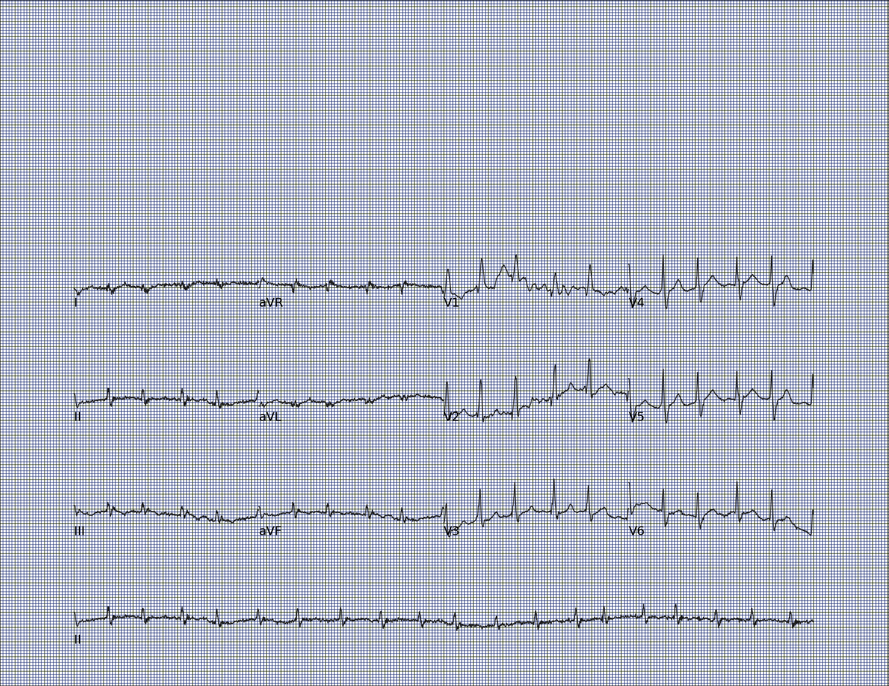
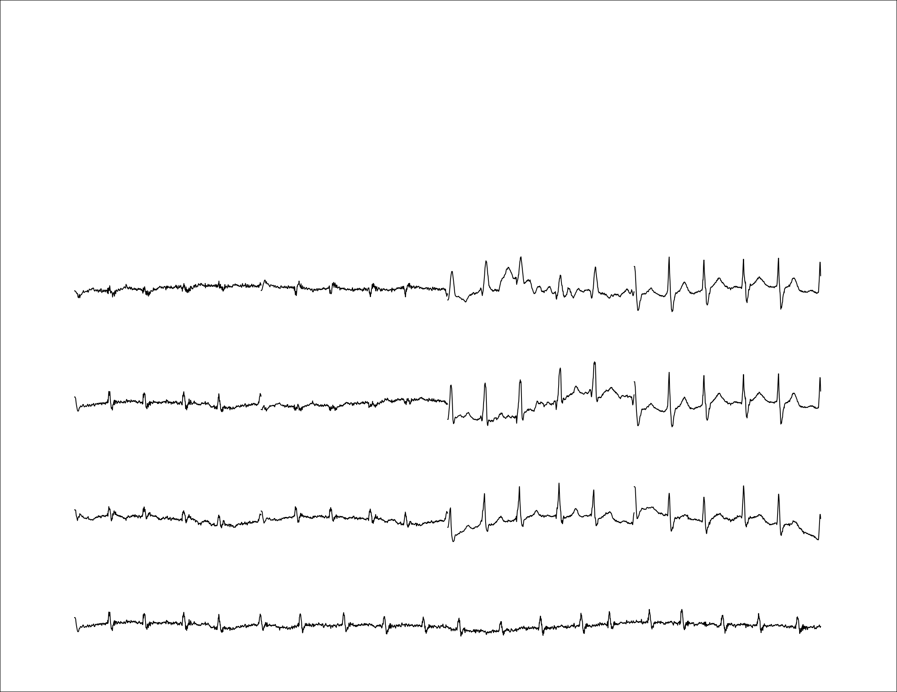
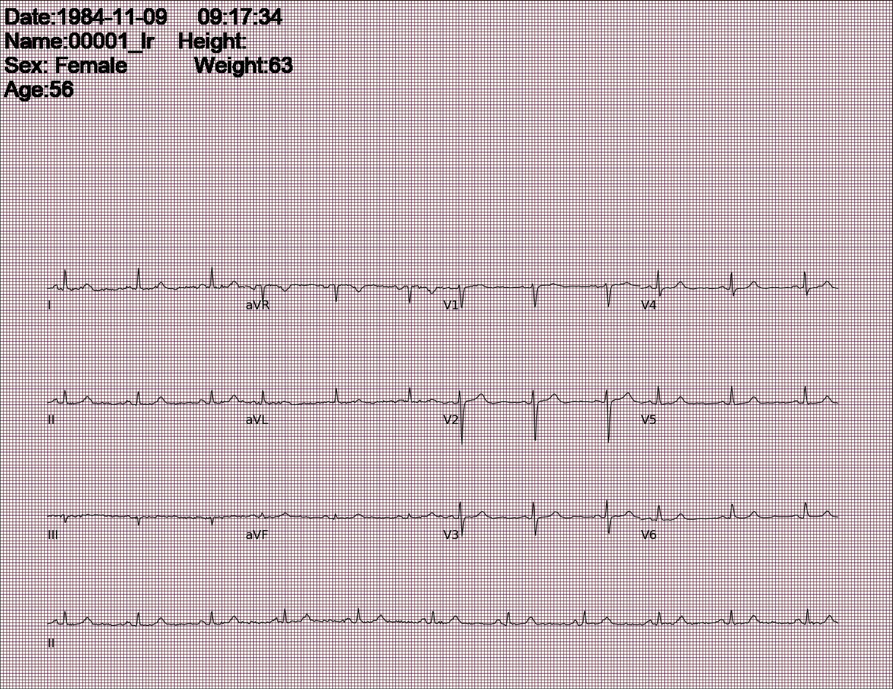
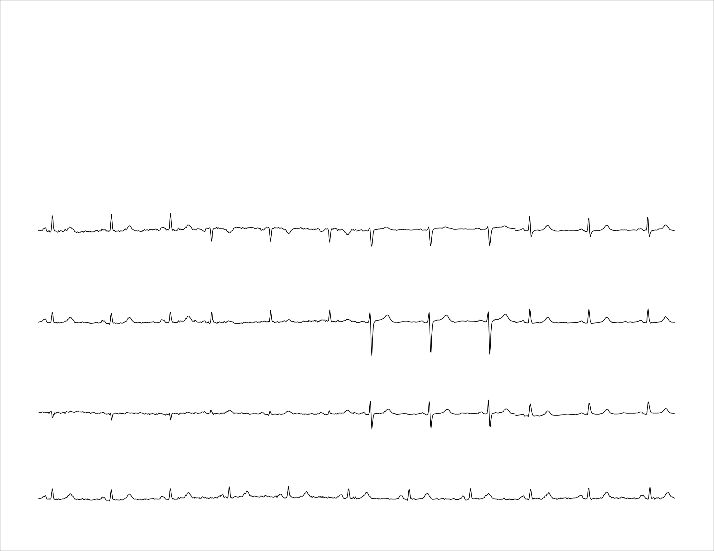
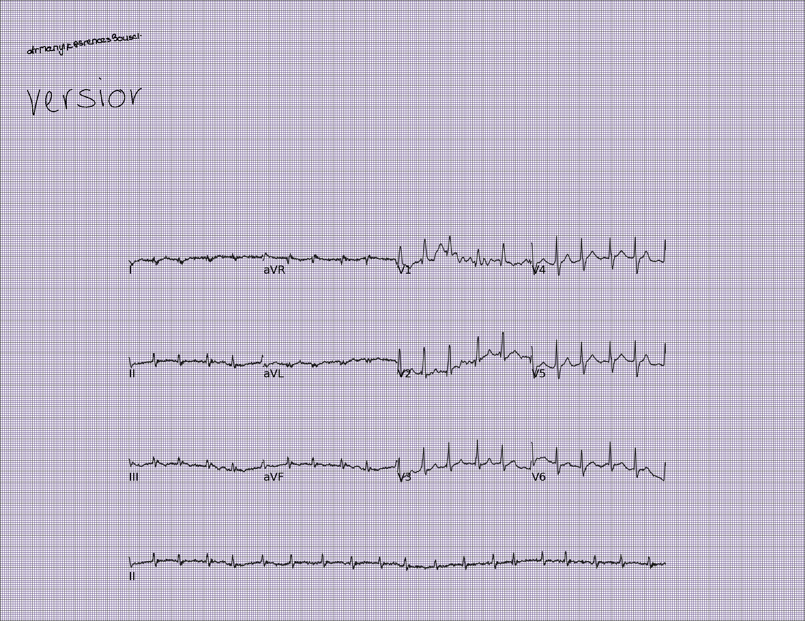
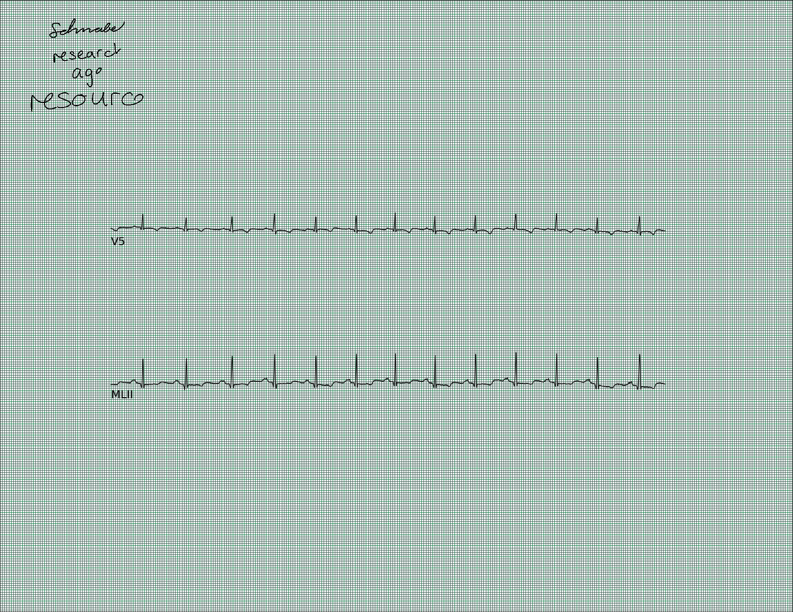
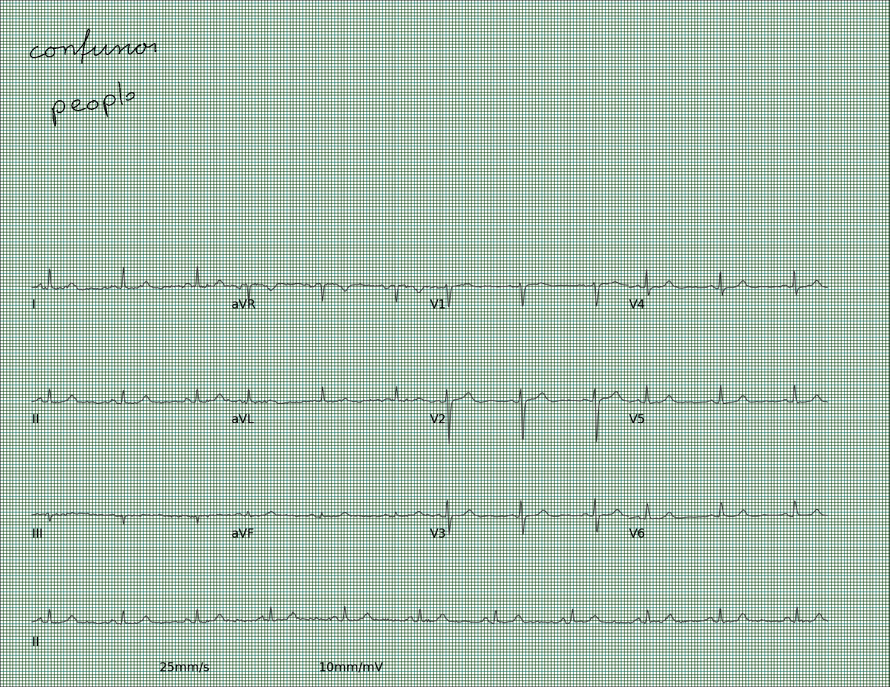
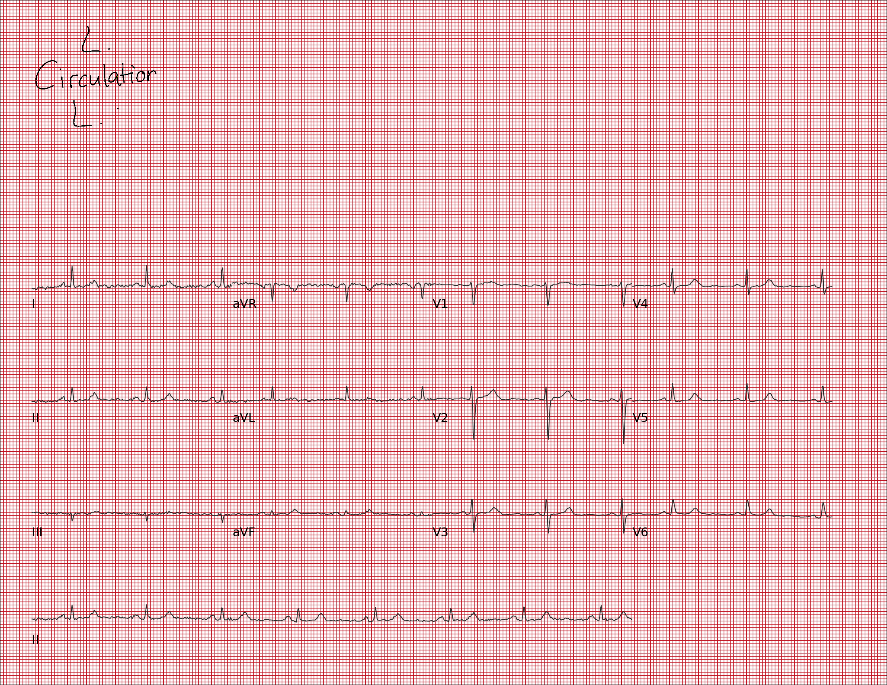

# `ecg-image-gen` - a toolkit for generating synthetic ECG images from time-series data
The ECG is a widely-used, accurate diagnostic tool for cardiovascular diseases. ECGs have traditionally been recorded in printed formats; their digitization holds immense potential for training machine learning and deep learning models in algorithmic ECG diagnosis. However, physical ECG archives risk deterioration, and scanning printed ECGs is insufficient, as advanced machine learning-based ECG diagnostic models require ECG data in time-series format for measuring clinical parameters and detecting anomalies. This necessitates the digitization and conversion of paper ECG archives into time-series data.

To address these challenges, we present methods and tools for generating synthetic ECG images on standard, paper-like ECG backgrounds, faithfully replicating realistic printing and scanning artifacts. Our approach includes applying various distortions, such as handwritten text artifacts (similar to physicians' clinical notes), wrinkles, creases, and perspective transforms, to the generated images while ensuring the absence of personally identifiable information. These synthetic ECG images provide a valuable resource for developing and evaluating machine and deep learning models for ECG analysis.

## 🚀 Release Update

- Code under maintanence, will be released soon!


## 💻 Installation
- Setup with Conda env: 
     ```
     conda env create -f environment_droplet.yml
     conda activate myenv
     ```

- Set up with pip:
     1. Install all the dependencies:
          ```
          pip install -r requirements.txt
          ```
     2. If you will be using the handwritten text distortions feature, install [sciSpacy](https://github.com/allenai/scispacy) with the following command:

          ```
          pip install https://s3-us-west-2.amazonaws.com/ai2-s2-scispacy/releases/v0.4.0/en_core_sci_sm-0.4.0.tar.gz
          ```
          
          Note that the requirements file has been compiled for python versions >= 3.8.11 and < 3.11
- Additional Instructions for MAC users:
     *  The text generation pipeline will make use of a different Parser object for BeautifulSoap. Change the parser object from "lxml" to "html5lib" on line 151 in [generate.py](codes/synthetic-ecg-image-generator/HandwrittenText/generate.py)


## Running the pipeline
- The python script to generate the ECG images requires two mandatory parameters; input directory with the ECG time-series data (in [PhysioNet's WFDB](https://www.physionet.org/content/wfdb/) format) and output directory to store the synthetic ECG images. Here is an example case of running the python script with only the mandatory arguments:

    
     ```bash
     python gen_ecg_images_from_data_batch.py -i <path_to_input_directory> -o <path_to_output_directory> -se 10
     ```
    

- The `gen_ecg_images_from_data_batch.py` script generates the following outputs at every iteration:

     * **Synthetic Image and GT image:** The pipeline will generate the images with ECG signals from all the leads along with gridlines and the name of the ECG lead. The pipeline will also generate the image without any artifacts and gridlines which can serve as a ground truth image. 
     * **gridsize.csv:** A csv file with the size of grid size of xgrid and ygrid, the start and end pixel values for each lead for each generated image. 
     * **text_bouding_box text file:** Text file with bouding box information (Format : x1, y2, x2, y1) along with the text.

     ### Example with 2 lead ECG input data data:

     ```bash
     python gen_ecg_images_from_data_batch.py -i ./SampleData/QT_data -o ./SampleData/GeneratedData --deterministic_lead -se 10
     ```

     Output can be found here: [./SampleData/GeneratedData](./SampleData/GeneratedData)

     | Synthetic ECG Image with gridlines and Lead names                            | Ground truth ECG image                            |
     | ----------------------------------- | ----------------------------------- |
     |  |  |


     ### Example with 12 lead ECG input data data:

     ```bash
     python gen_ecg_images_from_data_batch.py -i ./SampleData/QT_data -o ./SampleData/GeneratedData --deterministic_lead -se 10
     ```

     Output can be found here: [./SampleData/12lead_generated](./SampleData/12lead_generated)


     | Synthetic ECG Image with gridlines and Lead names                            | Ground truth ECG image                            |
     | ----------------------------------- | ----------------------------------- |
     |  |  |


     ### Synthetic Images generated with PTB XL dataset

     | Synthetic ECG Image with gridlines and Lead names                            | Ground truth ECG image                            |
     | ----------------------------------- | ----------------------------------- |
     |  |  |

## Generating distortionless ECG
The basic mode of the tool generates ECG images without any distortions. The flags that can be set in this mode are as follows: 
- `-se`: Seed controlling all the random parameters; type: int, required: True
- `-r`: Resolution with default being 200; type: int
- `--pad_inches`: Padding of white border along the image with default padding of 0 inches; type: int
- `--num_columns` : Number of columns of the ECG leads with default being -1; type: int
- `--full_mode`: Chooses which lead to add at the bottom of the paper ECG as a long full lead strip; default: `'II'`; type: str
- `--num_images`: Add how many ECG images you want to generate; default: all files in the input directory; type: int
- `--random_resolution`: Generate random resolutions of images; default: False
- `--random_padding`: Generate random padding widths on images; default: False
- `--random_dc`: Add calibration pulse to a random set of images controlled by this parameter; type: Float, default: 0. Make sure that `--random_dc` $\in$ [0, 1]. 
- `--random_grid_present`: Add grid to random set of images controlled by this parameter; type: Float, default: 1. Make sure that `--random_grid_present` $\in$ [0, 1].
- `--random_print`: Add printed text to a random set of images controlled by this parameter; type: Float, default: 0. Make sure that `--random_print` $\in$ [0, 1].
- `--random_bw`: Make random set of images black and white controlled by this parameter; type: Float, default: 0. Make sure that `--random_bw` $\in$ [0, 1].
- `--deterministic_lead`: Add lead names to all generated images; default: True 


## Adding distortions to the synethic images
- ### Text distortions
     It is common for scanned ECG images to have handwritten notes by the physician, which may or may not overlap with the ECG traces. The toolkit provides this option by getting a dictionary of relevant keywords and randomly placing them on the ECG images. We collected a set of medical text related to ECG and CVDs. We next applied Natural Language Processing (NLP) models on these text to compile a list of biomedical phrases and keywords from these texts. The resulting set was converted to handwritten style images using pretrained models and the resulting images were overlayed on the ECG images from the previous step of our pipeline. The Python-based en_core_sci_md model from [sciSpacy](https://github.com/allenai/scispacy), was used for the NLP step for tokenization, parts of speech tagging, dependency parsing and names entity recognition.  Next, the [SpaCy model](https://sentometrics-research.com/publication/72/)  was retrained on our collected medical texts to retain words in the ECG-CVD context. The dependency parser and the parts of speech tagger in the released models were retrained on the treebank of [McClosky and Charniak](https://www.semanticscholar.org/paper/Self-Training-for-Biomedical-Parsing-McClosky-Charniak/170479ac946ef294455005cc6fb6adb1d2df7a4f), which is based on the GENIA 1.0 corpus.  Our developed synthetic ECG image generation toolbox parses words from an input text file or from online links using the [BeatifulSoup library](https://www.crummy.com/software/BeautifulSoup/bs4/doc/), performs parts of speech tagging on the parsed words and then uses named entity recognition from the aforementioned models to identify ECG-related keywords, which are randomly chosen and add as handwritten text. A pretrained Recurrent Neural Network (RNN) transducer-based model paired with soft window is used to generate handwritten text from these extracted words.  

     Adding the `--hw_text` flag to the python command provides this feature. Furthermore, following attributes specific to the text can be adjusted: 

     - `-l`: URL to capture relevant ECG-related text for generating handwritten text artifacts; default: https://www.physionet.org/content/ptbdb/-0.0/; type: str
     - `-n`: Number of handwritten words to add; default: 5; type: int
     - `--x_offset`: Number of pixels by which we want to offset the words placed from the border of the image; default: 30; type: int
     - `--y_offset`: Number of pixels by which we want to offset the vertical placement of words from the upper border of the image; default: 30; type: int
     - `--deterministic_offset`: Use the provided offset parameters deterministically. If not, takes the offset parameters as a range by which we can offset the text; default: False
     - `--deterministic_num_words`: Uses the provided number of words deterministically. If False, it takes the number of words as a range and adds random number of words; default: False
     - `--deterministic_hw_size`: Uses a fixed handwriting size for the handwritten text artifacts added; default: False

     Example: 

     ```bash
     python gen_ecg_images_from_data_batch.py -i my_input_dir -o my_output_dir --deterministic_lead --hw_text -n 4 --x_offset 30 --y_offset 20 -se 10
     ```

     | 12 lead Image with handwritten text                            | 2 lead Image with handwritten text                            |
     | ----------------------------------- | ----------------------------------- |
     |  |  |

     ### Hand-written distortions on synthetic images generated from the PTB-XL dataset

     |                            |                             |
     | ----------------------------------- | ----------------------------------- |
     |  |  |


     Adding text artifacts is a computationally expensive process and should be run with GPU machines for large scale dataset generation.

- ### Wrinkles and creases
     Creases can be modeled by Gaussian-distributed blurred lines, linearly spaced to give an impression of creases caused by paper folds. To simulate the effect of blurring on crease lines, we apply Gaussian blurring to the generated crease lines, which is commonly used as an image augmentation technique to simulate smoothing or blurring effects in images. The application of Gaussian blurring to the created crease lines aids in generating more realistic images by simulating a shadow effect in the crease, which is commonly observed in scanned paper ECG images. Wrinkles can be thought of as textures and can thus be synthesized by state-of-the-art texture synthesis techniques such as image quilting. 

     Add `--wrinkes` to the python command to add wrinkle distoritions to the images. Furthermore following attributes specific to the wrinkles can be adjusted: 

     - `-ca`: Crease angle with respect to the image; default: 90
     - `-nv`: Number of creases to add vertically; Default: 10
     - `-nh`: Number of creases to add horizontally; default: 10
     - `--deterministic_angle`: Chooses the angle as a fixed crease angle for all images; default: False
     - `--deterministic_vertical`: Adds the number of vertical creases given deterministically to all images; default: False
     - `--deterministic_horizontal`: Adds the number of horizontal creases given dtereministically to all images; default: False

     Example:
     
     ```bash
     python gen_ecg_images_from_data_batch.py -i my_input_dir -o my_output_dir --wrinkles -ca 45 --deterministic_lead -se 10
     ```
     | 12 lead Image with wrinkles and creases                            | 2 lead Image with wrinkles and creases                            |
     | ----------------------------------- | ----------------------------------- |
     |  |  |

     ### Wrinkle and creases distortion on synthetic images generated from the PTB-XL dataset

     |                            |                             |
     | ----------------------------------- | ----------------------------------- |
     |  |  |

- ### Augmentation and noise
     Add `--augment` to the python command to add augmentations to the images. Furthermore following attributes specific to the wrinkles can be adjusted: 

     - `-rot`: Rotation angle by which images can be rotated; default: 0; type: int
     - `-noise`: Noise levels to be added; default: 50; type: int
     - `-c`: Percentage by which image will be cropped; default: 0.01; type: int
     - `-t`: Colour temperature changes to be added to the image; default: 40000; type: int
     - `--deterministic_rot`: Adds the given amount of rotation to all images deterministically. If False, chooses rotation angles randomly in the given range; default: False
     - `--deterministic_noise`: Adds the noise level given detreministcally to all images. If False, adds random amounts of noise in the given range; default: False
     - `--deterministic_crop`: Adds the given level of crop to all images deterministically. If False, adds random crop levels; default: False
     - `--deterministic_temp`: Adds the deterministic temperature level to all images. If False, adds random colour temepratures in that range; default- False

     Example:

     ```bash
     python gen_ecg_images_from_data_batch.py -i my_input_dir -o my_output_dir --augment -rot 5 -noise 40 --deterministic_rot --deterministic_noise --deterministic_lead -se 10
     ```

     | 12 lead Image with wrinkles and creases | 2 lead Image with wrinkles and creases |
     | ----- | ----- |
     |  |  | 

     ### Augmentation on synthetic images generated from the PTB-XL dataset

     |                            |                             |
     | ----------------------------------- | ----------------------------------- |
     |  |  |

     ### Adding Rotation and Crop Augmentation 
     ```bash
     python gen_ecg_images_from_data_batch.py -i my_input_dir -o my_output_dir --augment -rot 30 -c 0.1 --deterministic_rot --deterministic_noise --deterministic_lead -se 10
     ```

     |                            |                             |
     | ----------------------------------- | ----------------------------------- |
     |  |  |

     


- ### Adding all the distortions together:

     Example:

     ```bash
     python gen_ecg_images_from_data_batch.py -i my_input_dir -o my_output_dir --augment -rot 5 -noise 40 --deterministic_rot --deterministic_noise --hw_text -n 4 --x_offset 30 --y_offset 20 --wrinkles -ca 45 --deterministic_lead -se 10
     ```

     | 12 lead Image with wrinkles and creases  | 2 lead Image with wrinkles and creases|
     | ----- | ----- |
     | |  |


     ### All distortions on synthetic images generated from the PTB-XL dataset

     |                            |                             |
     | ----------------------------------- | ----------------------------------- |
     |  |  |


## Generating image from a single ECG record
- To provide more flexibility, we also allow users to generate synthetic ECG image from a single ECG record from a give index. The start index should be in the range: [0, len(signal))

     Example:
     ```
     python gen_ecg_image_from_data.py -i <path_to_input_file> -hea <path_to_header_file> -o <path_to_output_directory> -st start_index
     ```

## 🔧 Troubleshooting
- The following command does not add handwritten text artifacts to the image:

     ```bash
     python gen_ecg_images_from_data_batch.py -i my_input_dir -o my_output_dir -n 4 -x_offset 30 -y_offset 20 
     ```
     Remember to enable a particular distortion to add the given artifacts.

## Reference
[](https://doi.org/10.48550/ARXIV.2307.01946)

Shivashankara, K. K., Shervedani, A. M., and Sameni, R. (2023). A Synthetic Electrocardiogram (ECG) Image Generation Toolbox to Facilitate Deep Learning-Based Scanned ECG Digitization (Version 2). arXiv. https://doi.org/10.48550/ARXIV.2307.01946

## Contributors
- [Reza Sameni](rsameni@dbmi.emory.edu) (corresponding contributor), Department of Biomedical Informatics, Emory University, GA, US
- [Kshama Kodthalu Shivashankara](kshamashivashankar@gmail.com), School of Electrical and Computer Engineering, Georgia Institute of Technology, Atlanta, GA, USA
- [Deepanshi](deepanshi.asr.21@gmail.com), Department of Biomedical Informatics, Emory University, GA, US
- [Matthew Reyna](matthew@dbmi.emory.edu), Department of Biomedical Informatics, Emory University, GA, US
