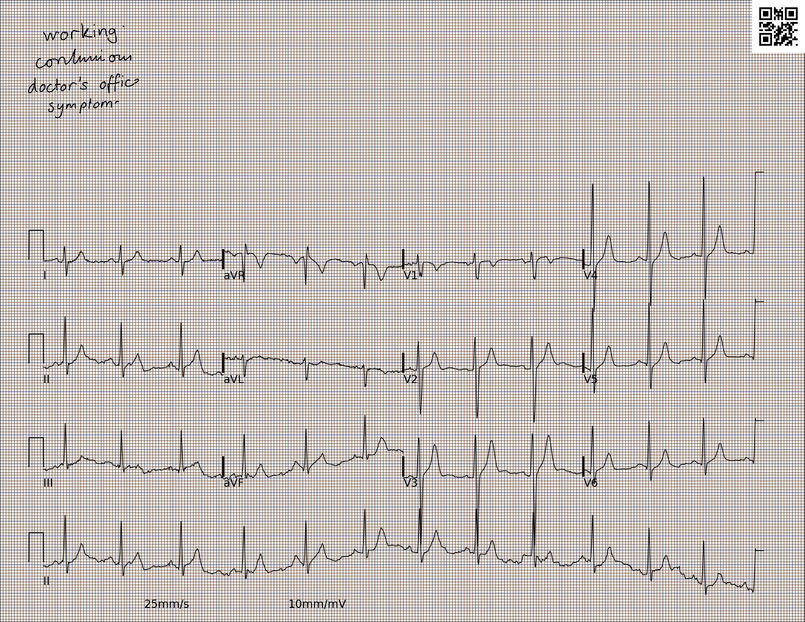
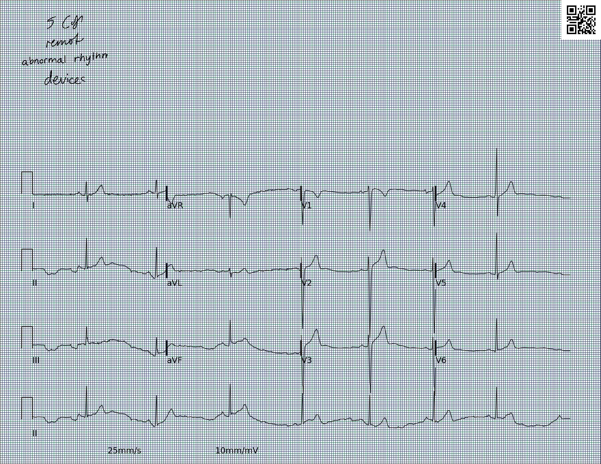
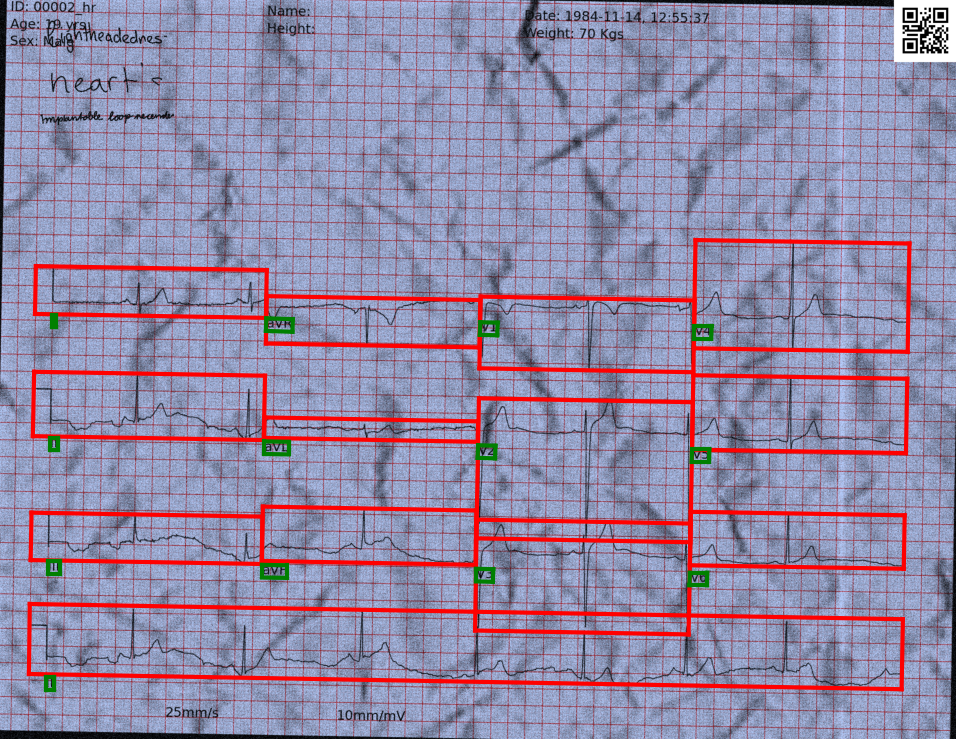
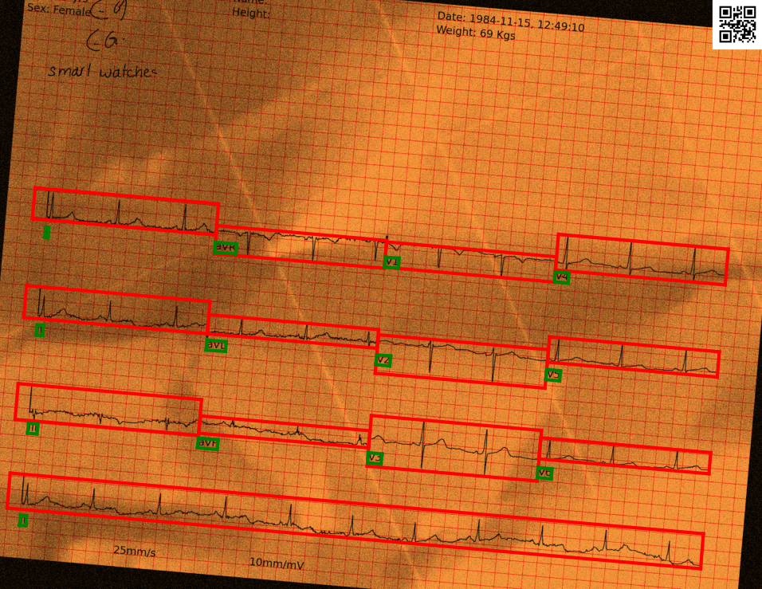
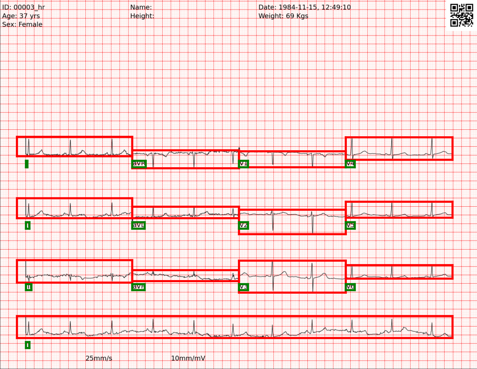

# `ecg-image-gen`
***Generating realistic ECG images from time-series data***

This folder contains tools for generating realistic ECG images from time-series data, creating synthetic ECGs on standard paper-like backgrounds with genuine printing and scanning artifacts. Our approach adds distortions such as handwritten notes, wrinkles, creases, and perspective transforms. These images are ideal for producing large sets of ECG images for the development and evaluation of machine and deep learning models in ECG analysis.

The process of scanning and digitizing ECG images is governed by some fundamental limitations and requiements rooting in signal and image processing theory. A short overview of these concepts is available in a brief document found [here](./documentation/ECG_IMAGE_RESOLUTION.md).

## Release History
- January 2024, initial public release

## Installation
- Setup with Conda env: 
     ```
     conda env create -f environment_droplet.yml
     conda activate myenv
     ```

- Set up with pip:
     1. Install all the dependencies:
          ```
          pip install -r requirements.txt
          ```
     2. If you will be using the handwritten text distortions feature, install [sciSpacy](https://github.com/allenai/scispacy) with the following command:

          ```
          pip install https://s3-us-west-2.amazonaws.com/ai2-s2-scispacy/releases/v0.5.0/en_core_sci_sm-0.5.0.tar.gz
          ```
          
          Note that the requirements file has been compiled for python versions >= 3.9 and < 3.11


## Running the pipeline
- The python script to generate the ECG images requires two mandatory parameters: the path to the input directory with the ECG time-series data and its header file (in [PhysioNet's WFDB](https://www.physionet.org/content/wfdb/) format) and the path to the output directory to store the synthetic ECG images. Here is an example case of running the python script with only the mandatory arguments:
 
    
     ```bash
     python gen_ecg_images_from_data_batch.py -i <path_to_input_directory> -o <path_to_output_directory> --print_header
     ```
    
- The `gen_ecg_images_from_data_batch.py` script produces the following outputs in each iteration:
    * **Synthetic ECG image:** Includes ECG signals from all leads, gridlines, and the name of each ECG lead.
    * **ECG header and data files:** New header and data files for each image that is generated. Note that if an input ECG file is generating multiple images, the code outputs only one header and data file. The header and data file might be different from the corresponding files, based on the input parameters. For eg:  If `--mask_unplotted_samples` is set, the unplotted samples are masked with Nan. See the section on `Generating distortionless images` for more details on the input parameters.
    * **Config JSON file (optional):** A JSON file detailing several parameters used to generate images, box, text and image annotations. See below for more details.

- Below are sample synthetic ECG images generated from sample records of the [PhysioNet PTB-XL](https://physionet.org/content/ptb-xl/) dataset.

     |                           |                             |
     | ----------------------------------- | ----------------------------------- |
     |  |  |

     *Note:* The ECG images generated for the format 3 by 4 (4 columns), the ECG signals for every column have been sampled in a shifted fashion, i.e. the leads in the first column (I, II, III) is from the first 2.5 seconds, the second column (aVR, aVL, aVF) is from the second 2.5 seconds, the third column (V1, V2, V3) is from the third 2.5 seconds segment and the fourth column (V4, V5, V6) is from the fourth 2.5 seconds segment of the respective lead of the ECG signal.

## Generating distortionless ECG
The basic mode of the tool creates ECG images without distortions. The mode of operation and generated outputs can be configured using these command-line flags:

- `-se`: Seed controlling all the random parameters; type: int
- `-r`: Resolution with default being 200; type: int
- `--pad_inches`: Padding of white border along the image with default padding of 0 inches; type: int
- `--print_header`: Add text from header file on all the generated images; default: False
- `--add_qr_code`: Add QR code to all the generated images, default: False. The QR code links to the relative path of the WFDB file used to generate the ECG image. 
- `--num_columns` : Number of columns of the ECG leads. The default(-1) will plot a single column for 2 lead data and 4 columns for the 12 or any other number of lead data. Default: -1; type: int
- `--full_mode`: Sets the lead to add at the bottom of the paper ECG as a long strip obtained from the WFDB record's `.hea` header file, if the lead II is not available plots the first lead from the header file; default: `'II'`; type: str
- `--mask_unplotted_samples`: Mask the samples not plotted in the images in the generated WFDB signal file; default: False. For example: for the 3x4 format, the code plots 2.5 seconds of each lead on the image and saves the complete signal in the WFDB file. If the flag is set, the code will mask the part of the signal not plotted in the image (In this case, t > 2.5seconds) with Nan values in the modified WFDB file. 
- `--max_num_images`: Number of ECG images to be generated, if max_num_images is less than the number of files in the input directory it will generate maximum number of images and the order is dependent on the OS library; default: all files in the input directory; type: int
-   `--remove_lead_names`: Remove lead names from all generated images, default=False.
- `--random_resolution`: Generate random resolutions of images, if True resolution is randomly picked from the range [50, `r`] else every image is generated at the `-r` resolution; default: False
- `--random_padding`: Generate random padding widths on images, if True pad inches is randomly picked from the range [0, `--pad_inches`], else every image is padded with `--pad_inches`; default: False
- `--calibration_pulse`: Add ECG calibration pulse to a random number of generated images. The parameter is the probability of the images having the calibration pulse; type: Float, default: 1 (calibration pulse on all the images). Set to 1 to add the pulse to all images. Make sure that `--calibration_pulse` $\in$ [0, 1]. 
- `--random_grid_present`: Probability of the generated images having the ECG paper grid; type: Float, default: 1 (adds the grid to all images). Make sure that `--random_grid_present` $\in$ [0, 1]. When 0, the images do not have the background grid.
- `--random_print_header`: Probability of adding printed text to a random set of images; type: Float, default: 0 (no text added). Make sure that `--random_print_header` $\in$ [0, 1]. If `--print_header` is True, code prints text on all the images regardless of the `--random_print_header` attribute.
- `--random_bw`: Make random set of images black and white controlled by this parameter; type: Float, default: 0 (generates colored ECG). Make sure that `--random_bw` $\in$ [0, 1].
- `--standard_grid_color`: Color of the grid lines, 1: brown, 2: pink, 3: blue, 4: green, 5(Default): red .Make sure that `standard_grid_color` $\in$ [1, 5], type: int
- `--random_grid_color`: Generates random colors for the gridlines, If `'--random_bw` > 0, then the color of gridlines for the non black and white ECG images is picked randomly. Default: False.
- `--store_config`: Store config information for each image in a json file, type = int, Default: 0, constant value: 1, If `--store_config` is set to 1, the config file has high level attributes, refer template1.json. If  `--store_config` is set to 2, config file will have more detailed information, refer template2.json.
- `--lead_name_bbox`: Store bounding box coordinates for the lead names in the json file under the attribute `text_bounding_box` in the config JSON file generated for every record (conditional); Add `--store_config` parameter to the command you are running. Note: Add `--store_config` parameter to the command you are running to save the config file with bounding box information. 
- `--lead_bbox`:  Store bounding box coordinates for every individual ECG lead signal in the json file under the attribute `lead_bounding_box` in the config JSON file generated for every record (conditional). Note: Add `--store_config` parameter to the command you are running to save the config file with bounding box information. 

     **Example:** 
     ```bash
     python gen_ecg_images_from_data_batch.py -i <path_to_input_directory> -o <path_to_output_directory> -se 10 --lead_name_bbox --lead_bbox --random_add_header 0.8 --calibration_pulse 0.5 --store_config 1 --add_qr_code
     ```

## Adding distortions to the synethic images
- ### Text distortions
     Scanned ECG images often contain handwritten notes by physicians, sometimes overlapping the ECG traces. Our toolkit simulates this by using a dictionary of relevant keywords, which are randomly placed on the ECG images. We gathered medical texts related to ECG and cardiovascular diseases and employed Natural Language Processing (NLP) models to extract biomedical phrases and keywords. These were transformed into handwritten-style images using pretrained models and overlaid on the ECG images.

     For NLP, we utilized the Python-based `en_core_sci_md` model from [sciSpacy](https://github.com/allenai/scispacy) for tokenization, parts of speech tagging, dependency parsing, and named entity recognition. The [SpaCy model](https://sentometrics-research.com/publication/72/) was retrained with our medical texts, focusing on ECG and cardiocascular context. We also retrained the dependency parser and parts of speech tagger using the McClosky and Charniak treebank, based on the GENIA 1.0 corpus.

     Our toolbox generates synthetic ECG images by parsing words from text files or online sources using the [BeautifulSoup library](https://www.crummy.com/software/BeautifulSoup/bs4/doc/), tagging them, and identifying ECG-related keywords with named entity recognition. These keywords are then converted into handwritten text using a pretrained Recurrent Neural Network (RNN) transducer-based model with a soft window.

     Adding the `--hw_text` flag to the python command provides this feature. Furthermore, following attributes specific to the text can be adjusted: 

     - `-l`: URL to capture relevant ECG-related text for generating handwritten text artifacts; default: [https://www.physionet.org/content/ptbdb/](https://www.physionet.org/content/ptbdb/); type: str
     - `-n`: Number of handwritten words to add; default: 5; type: int
     - `--x_offset`: Defines the horizontal offset (in pixels) of the placed words from the image's border; default value: 30; data type: int.
     - `--y_offset`: Sets the vertical offset (in pixels) of word placement from the image's top border; default value: 30; data type: int.
     - `--deterministic_offset`: Use the provided offset parameters deterministically(Text is printed at [`x_offset`, `y_offset`]). If not, randomizes the text position based on `x_offset` and `y_offset` (x coordinate range:[1, `x_offset`+1], y coordinate range: [1, `y_offset`+1]); default: False
     - `--deterministic_num_words`: Uses the provided number of words deterministically. If False, it takes the number of words as a range and adds random number of words; default: False
     - `--deterministic_hw_size`: Uses a fixed handwriting size for the handwritten text artifacts added; default: False
    
     **Example:** 

     ```bash
     python gen_ecg_images_from_data_batch.py -i my_input_dir -o my_output_dir --hw_text -n 4 --x_offset 30 --y_offset 20 -se 10 --random_grid_color --add_qr_code
     ```

     - Below are sample synthetic ECG images with handwritten text generated from sample records of the [PhysioNet PTB-XL](https://physionet.org/content/ptb-xl/) dataset using the script above.

     |                            |                             |
     | ----------------------------------- | ----------------------------------- |
     |  |  |


     Adding text artifacts is a computationally expensive process and should be run with GPU machines for large scale dataset generation.

- ### Wrinkles and creases
     Creases are simulated using Gaussian-blurred lines, evenly spaced to mimic paper fold creases. Gaussian blurring, a common image augmentation technique for smoothing effects, is applied to these lines. This blurring enhances realism by creating a shadow effect in the creases, common in scanned images or real paper ECG. For wrinkles, which are essentially textures, advanced texture synthesis methods like image quilting are used.

     Add `--wrinkes` to the python command to add wrinkle distoritions to the images. Furthermore following attributes specific to the wrinkles can be adjusted: 

     - `-ca`: Crease angle (in degrees) with respect to the image; default: 90
     - `-nv`: Number of creases to add vertically; Default: 10
     - `-nh`: Number of creases to add horizontally; default: 10
     - `--deterministic_angle`: Chooses a fixed crease angle for all images; default: False
     - `--deterministic_vertical`: Adds the given number of vertical creases deterministically to all images; default: False
     - `--deterministic_horizontal`: Adds the given number of horizontal creases detereministically to all images; default: False

     **Example:**
     
     ```bash
     python gen_ecg_images_from_data_batch.py -i my_input_dir -o my_output_dir --wrinkles -ca 45 -se 10 --random_grid_color --add_qr_code
     ```

     - Wrinkle and creases distortion on synthetic images generated from the [PhysioNet PTB-XL](https://physionet.org/content/ptb-xl/)

     |                            |                             |
     | ----------------------------------- | ----------------------------------- |
     |  |  |

- ### Augmentation and noise
     Add `--augment` to the python command to add augmentations to the images. Furthermore following attributes specific to the wrinkles can be adjusted: 

     - `-rot`: Rotation angle by which images can be rotated; default: 0; type: int
     - `-noise`: Noise levels to be added; default: 50; type: int
     - `-c`: Percentage by which image will be cropped; default: 0.01; type: int
     - `-t`: Colour temperature changes to be added to the image; default: 40000; type: int
     - `--deterministic_rot`: Adds the given amount of rotation to all images deterministically. If False, chooses rotation angles randomly in the given range; default: False
     - `--deterministic_noise`: Adds the noise level given detreministcally to all images. If False, adds random amounts of noise in the given range; default: False
     - `--deterministic_crop`: Adds the given level of crop to all images deterministically. If False, adds random crop levels; default: False
     - `--deterministic_temp`: Adds the deterministic temperature level to all images. If False, adds random colour temepratures in that range; default- False

     **Example:**

     ```bash
     python gen_ecg_images_from_data_batch.py -i my_input_dir -o my_output_dir --augment -rot 5 -noise 40 --deterministic_rot --deterministic_noise -se 10 --random_grid_color
     ```

     - Augmentation on synthetic images generated from the [PhysioNet PTB-XL](https://physionet.org/content/ptb-xl/)

     |                            |                             |
     | ----------------------------------- | ----------------------------------- |
     |  |  |

     ### Adding Rotation and Crop Augmentation 
     ```bash
     python gen_ecg_images_from_data_batch.py -i my_input_dir -o my_output_dir --augment -rot 30 -c 0.1 --deterministic_rot --deterministic_noise -se 10
     ```

     |                            |                             |
     | ----------------------------------- | ----------------------------------- |
     |  |  |


- ### Adding all the distortions together:

     **Example:**

     ```bash
     python gen_ecg_images_from_data_batch.py -i my_input_dir -o my_output_dir --augment -rot 5 -noise 40 --deterministic_rot --deterministic_noise --hw_text -n 4 --x_offset 30 --y_offset 20 --wrinkles -ca 45 -se 10 --print_header --add_qr_code
     ```

     - All distortions on synthetic images generated from the [PhysioNet PTB-XL](https://physionet.org/content/ptb-xl/)

     |                            |                             |
     | ----------------------------------- | ----------------------------------- |
     |  |  |

     **Example:**

     ```
     python gen_ecg_images_from_data_batch.py -i <input_dir> -o <output_dir> --random_add_header 0.8 -se 20 --lead_name_bbox  --resolution 300 --random_padding --pad_inches 1 --lead_bbox --augment -rot 5 -noise 40 --deterministic_rot --deterministic_noise --hw_text -n 4 --x_offset 30 --y_offset 20 --wrinkles -ca 45 
     ```

     |                            |                             |
     | ----------------------------------- | ----------------------------------- |
     |  |  |

     ### Distortionless images with Bounding box annotations
     |                           |                             |
     | ----------------------------------- | ----------------------------------- |
     |  |  |

     *Note*: The red and green boxes here have been plotted from the corresponding text files for each lead and lead-name text.

## Generating image from a single ECG record
- To provide more flexibility, we also allow users to generate synthetic ECG image from a single ECG record from a give index. The start index should be in the range: [0, len(signal))

     **Example:**
     ```
     python gen_ecg_image_from_data.py -i <path_to_input_file> -hea <path_to_header_file> -o <path_to_output_directory> -st start_index
     ```

     *Note:* Following pointers should be kept in mind, while generating images from a single record:
     
     - If the length of the signal from the `-st` is less than 10 seconds, the image will not be generated
     - All the batch level attributes explained above can be used to generate the image from `gen_ecg_image_from_data.py`

## Troubleshooting
- The following command does not add handwritten text artifacts to the image:

     ```bash
     python gen_ecg_images_from_data_batch.py -i my_input_dir -o my_output_dir -n 4 -x_offset 30 -y_offset 20 
     ```
     Remember to enable a particular distortion to add the given artifacts.


## Run-time benchmarks
Average computational time for generating an ECG image of size 2200 X 1700 pixels and 200 DPI on a MAC OS 13.4.1 (c) and Apple M2 chip

|  Steps | Time taken by each step per image (in seconds) |
| ------------- | ------------- |
| Distortion less ECG  | 0.72 |m
| Distortion less ECG with printed text  | 0.87  |
| ECG with Hand written text distortion | 6.25 |
| ECG with Creases and Wrinkles distortions | 0.92 |
| ECG with Augmentations (Noise and rotation)  | 2.65  |
| ECG with all distoritons (Hand-written text, creases, wrinkles, rotation, noise)  | 7.75  |


## Citation
Please include references to the following articles in any publications:

1. Kshama Kodthalu Shivashankara, Deepanshi, Afagh Mehri Shervedani, Matthew A. Reyna, Gari D. Clifford, Reza Sameni (2024). ECG-image-kit: a synthetic image generation toolbox to facilitate deep learning-based electrocardiogram digitization. In Physiological Measurement. IOP Publishing. doi: [10.1088/1361-6579/ad4954](https://doi.org/10.1088/1361-6579/ad4954)


2. ECG-Image-Kit: A Toolkit for Synthesis, Analysis, and Digitization of Electrocardiogram Images, (2024). URL: [https://github.com/alphanumericslab/ecg-image-kit](https://github.com/alphanumericslab/ecg-image-kit)

## Contributors
- Deepanshi, Department of Biomedical Informatics, Emory University, GA, US
- Kshama Kodthalu Shivashankara, School of Electrical and Computer Engineering, Georgia Institute of Technology, Atlanta, GA, US
- Matthew A Reyna, Department of Biomedical Informatics, Emory University, GA, US
- Gari D Clifford, Department of Biomedical Informatics and Biomedical Engineering, Emory University and Georgia Tech, GA, US
- Reza Sameni (contact person), Department of Biomedical Informatics and Biomedical Engineering, Emory University and Georgia Tech, GA, US

## Contact
Please direct any inquiries, bug reports or requests for joining the team to: [ecg-image-kit@dbmi.emory.edu](ecg-image-kit@dbmi.emory.edu).


