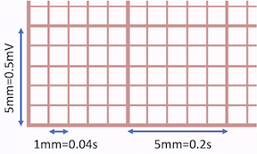
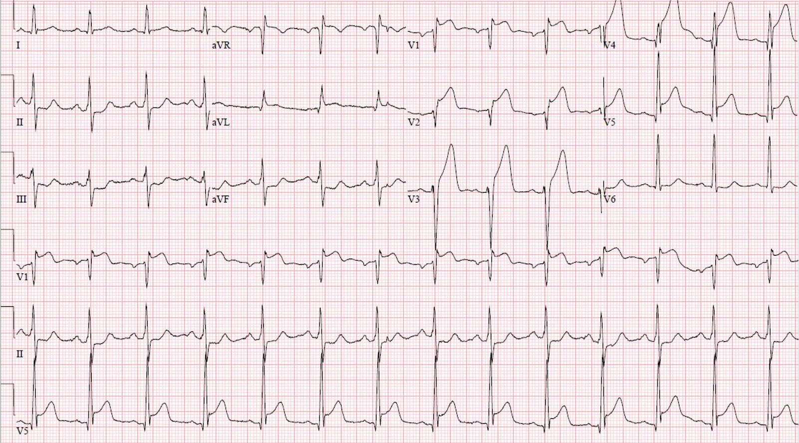

# A note on electrocardiogram image vs time-series resolutions

[Reza Sameni](rsameni@dbmi.emory.edu)

Department of Biomedical Informatics, Emory University

January 2024
## ECG as a time-series
The electrocardiogram (ECG), recorded by standard body surface leads, typically has an amplitude of several millivolts, and its spectral content ranges from approximately 0.05Hz to around 150Hz. When transformed into a digital signal, it first passes through an anti-aliasing low-pass filter (in the analog domain) before being sampled at a sampling frequency $f_s$. According to the Nyquist theorem, the cutoff frequency of the anti-aliasing filter should be lower than $f_s/2$. Systems with lower resolution, such as old single-lead ECG machines, Holder monitors and wearable devices, may have sampling frequencies as low as 100Hz. Modern high-quality clinical monitors often sample at higher frequencies, such as 1000Hz or more. Non-uniform (irregular) sampling is a less common, yet viable, option employed in some low-power, microcontroller-based devices. These devices satisfy the Nyquist frequency only on average but do not adhere to precise sampling times. This flexibility allows for accommodation of other microcontroller processes that run concurrently in the background. For more in-depth information on Nyquist theory, uniform and non-uniform sampling theory refer to the references [[Oppenheim 1998]](#ref-oppenheim-discrete), [[Marvasti 2001]](#ref-marvasti-nonuniform), [[Mitra 2001]](#ref-mitra-dsp).

The amplitude resolution of the digital signal depends on the number of bits of the analog-to-digital converter (ADC), denoted by $N$. In older ECG devices, $N$ was as low as 8 bits, resulting in a maximum resolution of 256 quantization levels (assuming that the ECG was amplified to span the ADC's full dynamic range). In modern ECG devices, $N$ can be up to 24 bits, resulting in significantly better amplitude resolution. It is important to note that due to electronic and thermal noise, and depending on the quality of the analog front-end circuitry, the effective number of bits (ENOB) is, in practice, lower than the nominal ADC bit number $N$. For instance, a 16-bit ADC may yield between 12.5 to 14 ENOBs in practice. With an $N$-bit ADC digitizing the input voltage range of $V_{min}$ to $V_{max}$, the voltage resolution after digitization is:

$$\delta v = \frac{V_{max} - V_{min}}{2^N}$$

For example, if the input span of the ADC is $\Delta_v=V_{max} - V_{min} = 5mV$, an 8-bit ADC yields a voltage resolution of $\delta v=19.5\mu V$, while a 12-bit ADC yield $\delta v=1.22\mu V$, improving the voltage resolution by a factor of 16. Further details regarding the ENOB and its relationship with $N$ and $f_s$ can be found here[[Sameni 2018]](#ref-sameni-digital).

## Printed ECG
In clinical applications, the ECG is printed on standard ECG paper featuring fine grids and coarse grids. The fine grids are 1mm by 1mm, corresponding to 0.1mV in amplitude and 40ms in time. The coarse grids are 5mm by 5mm, corresponding to 0.5mV in amplitude and 200ms in time, as shown in the image below.

In modern ECG devices, despite the data being collected digitally and stored on computers or other digital platforms, the same convention is used. ECGs are visualized against the same background grids, whether displayed on a computer screen or printed as a PDF or image file. The number and format of the leads, along with the ECG grid color, vary depending on the ECG acquisition technology and the device manufacturer. The most common clinical ECGs are 12-lead, featuring approximately 2.5-second segments of the 12 leads arranged in a 3-row by 4-column grid. Additionally, one to three leads (typically leads II, V1, V2, or V5) are displayed as a longer 10-second strip at the bottom. Below is an example of a typical ECG image.

## Scanned ECG images
Printing an analog or digital ECG on paper and then rescanning it as an image involves implicit or explicit interpolation and resampling of the original ECG. When performed by an analog machine or a standard printer, it involves digital-to-analog circuitry to convert the discrete time samples into a continuous waveform, printed as a continuous curve on the paper. Once an ECG is printed, the original sampling frequency $f_s$ of the digital time series, and the number of its quantization bits $N$, become irrelevant, as the signal has been transformed back into the continuous-time domain. When the ECG paper is scanned or photographed as an image, it is essentially being quantized and resampled again, this time as a two-dimensional image. Assuming the image is scanned at a resolution of $D$ dots per inch (DPI), each 1-inch by 1-inch square of the printed ECG is quantized into a $D \times D$ array, each pixel stored in $B$ bits (this is different from the bits of the ADC). If scanned as a color image, there will be three such arrays, corresponding to the colors red, green, and blue. Modern images typically use $B = 8$, resulting in 24 bits, or 3 bytes, per pixel. Therefore, for example, scanning a letter-size paper of 11 inches by 8.5 inches at 72 DPI would require 8.5 $\times$ 11 $\times$ (72 $\times$ 72) $\times$ 3 bytes = 1,454,112 bytes, or 1.39MB, as an uncompressed bitmap file (excluding any metadata or other headers stored in the file). In practice, fewer bits, corresponding to a lower color depth, and/or lossy or lossless image compression, can reduce the storage needed to save such an image with minimal or no loss of information, although scanning and other artifacts may impede compression.

Therefore, when a standard ECG, printed on A4 or letter-size paper, is scanned at full image size (without any cropping or excess borders), each 1 inch (25.4mm) horizontally and vertically maps to $D$ pixels. In other words, each coarse square of the ECG (0.5mV in amplitude and 200ms in time) maps to a square of $(\frac{5 \times D}{25.4})\times(\frac{5 \times D}{25.4})$ pixels. This means the amplitude resolution of the scanned ECG is $$dv = \frac{2.54 mV}{D}$$ and the temporal resolution is $dt = \frac{1.016s}{D}$ seconds, or equivalently, the sampling frequency (in Hertz) of the ECG (as an image) is $$f_s' = \frac{D}{1.016}$$

As we can see, the effective sampling frequency $f_s'$ of the scanned ECG is independent of the original digital signal's sampling frequency $f_s$. However, since the original signal's frequency range was limited to $f_s/2$ by the analog front-end anti-aliasing filter, increasing $D$, and therefore $f_s'$, will yield smoother waveforms, but it will not add any information beyond $f_s/2$.

From the above equation, it is evident that typical image resolutions, such as 72 or 96 DPI, which are common in image analysis applications, are quite low for ECG scanning and digitization applications, as they only provide sampling frequencies of 70.9Hz and 94.5Hz, respectively. Based on this analysis, a resolution of at least 150 DPI or higher, without any lossy compression, is recommended for ECG scanning and digitization purposes.

Importantly, the calculation of the ECG grid size from the image DPI and paper size is accurate only when using a standard full-paper size scanner. For ECG images captured by cameras, smartphones, screenshots, or through cropping and resizing, the equivalency of 1 inch on the actual paper to the captured image DPI may not hold true. Consequently, ECG digitization algorithms should estimate the correct grid sizes by employing algorithms that detect and analyze the ECG grid sizes directly from the ECG image. Several functions for this purpose are provided in the [`ecg-image-digitizer`](../../ecg-image-digitizer/) toolkit. Further details and examples can be followed from [[Shivashankara 2023]](#ref-ecg-image-kit-paper).

## Citation
Please include references [[Shivashankara 2023]](#ref-ecg-image-kit-paper) and [[ECG-Image-Kit]](#ref-ecg-image-kit) in publications related to this article.

## References

1.  Oppenheim, A. V., Schafer, R. W., & Buck, J. R. (1998). Discrete-time signal processing (2nd ed.). Upper Saddle River, NJ: Pearson. ISBN: 9780137549207

1.  Marvasti, Farokh, ed. Nonuniform Sampling: Theory and Practice. (2001). Netherlands: Springer US.

1.  Mitra, Sanjit K. Digital signal processing: a computer-based approach. McGraw-Hill Higher Education, 2001.

1.  Reza Sameni. Digital Systems Design. Engineering school. Iran. 2018. ⟨cel-01815308⟩. Online at: https://hal.science/cel-01815308v1

1.  Kshama Kodthalu Shivashankara, Deepanshi, Afagh Mehri Shervedani, Matthew A. Reyna, Gari D. Clifford, Reza Sameni (2023). A Synthetic Electrocardiogram (ECG) Image Generation Toolbox to Facilitate Deep Learning-Based Scanned ECG Digitization. arXiv. Online at: https://doi.org/10.48550/ARXIV.2307.01946

1.  ECG-Image-Kit: A Toolkit for Synthesis, Analysis, and Digitization of Electrocardiogram Images, January 2024, Online at: https://github.com/alphanumericslab/ecg-image-kit

